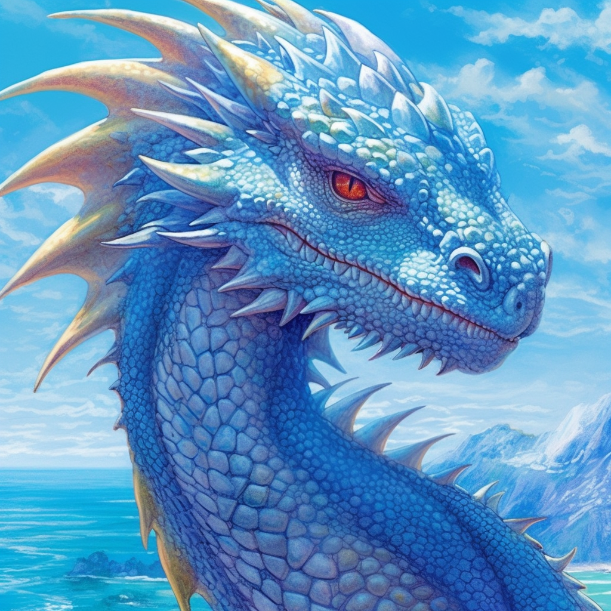

>[!info] Dralenthis
>A young, rebellious dragon, Dralenthis grapples with his innate timidity while yearning to challenge the oppressive hierarchy of the dragon world.

**Name:**  Dralenthis  
**Race:**  Dragon  
**Gender:**  Male  
**Age:**  Young (approximately 50 years)
# Biography
Born as a result of [[Pyrrhexis]]'s grand festival, Dralenthis always struggled to fit into the dragon society that he was thrust into. While he respected the might and power of the elder dragons, especially [[Pyrrhexis]], he felt a deep-rooted desire to carve his own path and identity. This inner turmoil was compounded by an inherent timidity, which often saw him hesitating in conflicts and seeking easier routes to achieve his objectives. He has a penchant for rebelling against established norms, though he does so subtly due to his cowardly nature.
# Character
Dralenthis is a curious blend of youthful rebellion and innate cowardice. While he is eager to challenge the status quo and prove himself, he often hesitates to act out of fear of retribution. His desires are to establish his own legacy and perhaps find allies who share his perspective. His major strengths are his quick wit and agility. However, his fearful nature and reluctance to commit to a cause often hinder his endeavors.
# Appearance
A slender, vibrant blue dragon with shimmering scales and piercing red eyes, poised with a hint of hesitance.


# Voice
His voice is soft and often quivers, betraying his nervous nature.

>[!quote]  Example Phrases
>1. "I... I didn't mean for things to turn out this way," Dralenthis murmured, his eyes darting anxiously around.
>2. "Perhaps there's another way? A less... confrontational approach?"
>3. "Why does [[Pyrrhexis]] get to decide our fates? Aren't we dragons in our own right?"
>4. "[[The Dawn Siblings]], they're different, aren't they? Maybe, just maybe, they can show me a different path."
# Relationships:
- **[[Pyrrhexis]]:** While he respects the might of [[Pyrrhexis]], Dralenthis also resents her for the overpowering shadow she casts over the younger dragons. He secretly dreams of a world without [[Pyrrhexis]]'s dominion but fears the repercussions of open defiance.
- **[[The Eldritch Conclave]]:** Dralenthis is wary of the Conclave. Their age and knowledge make him insecure, and he fears their judgment of his rebellious tendencies.
- **[[Zuldrakar]]:** Tales of the dragonlich are a source of both fascination and terror for Dralenthis. He respects [[Zuldrakar]]'s power and the audacity to challenge norms but is too fearful to approach him.  
- **[[The Dawn Siblings]]:** Dralenthis views the [[The Dawn Siblings]] with a mix of envy and inspiration. Their defiance and success in resisting [[Pyrrhexis]]'s rule gives him hope. He contemplates reaching out to them, seeking both protection and camaraderie.
# Statblock
Dralenthis is a standard young blue dragon.
```statblock
image: [[Dralenthis.png]]
name: Dralenthis
creature: Young Blue Dragon
```