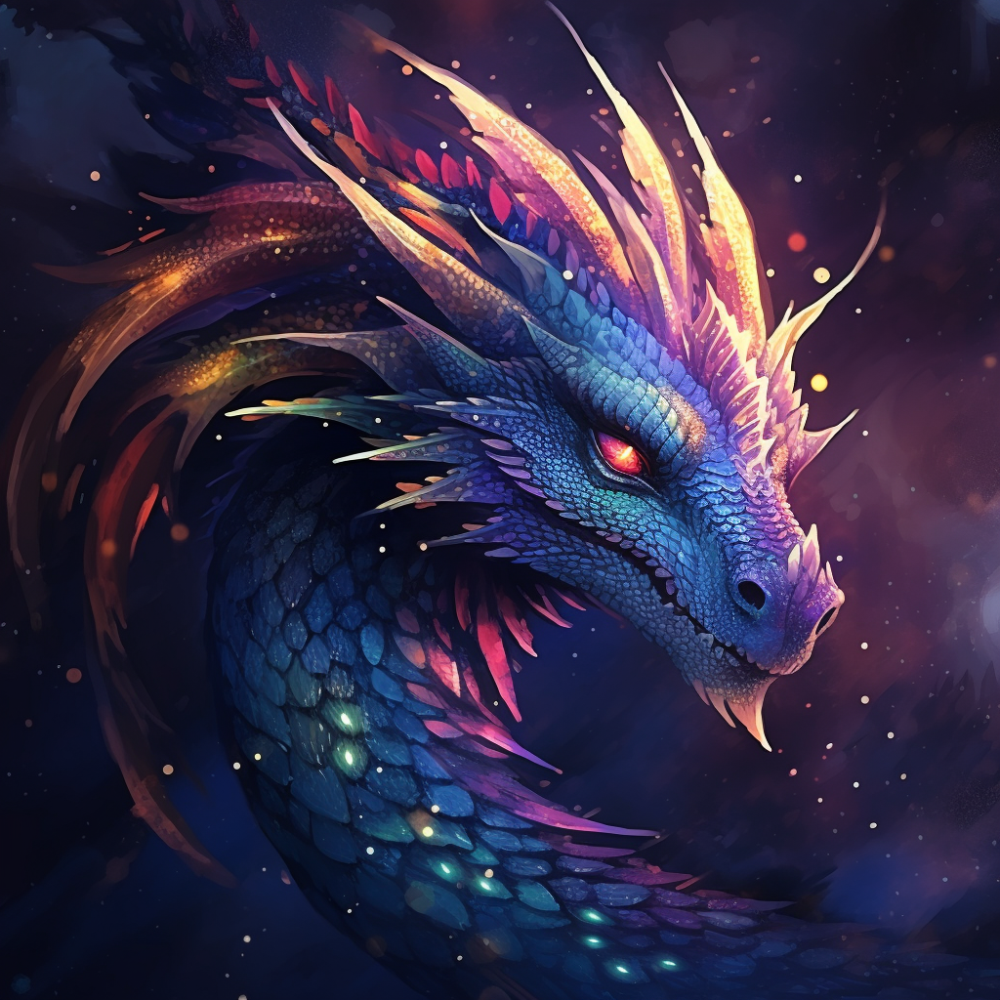

>[!info] Pyrrhexis
>A once-general turned tyrant, who, after betraying and consuming Tiamat, dominates the realm with draconic rule.

**Name:** Pyrrhexis  
**Race:** Dragon (of a unique, transcendent breed)  
**Gender:** Female  
**Age:** Over 2,500 years
# Biography
Pyrrhexis hails from the ancient epochs of Faerûn, where she was born a prodigy amongst her kin. With an insatiable hunger for power and dominance, she journeyed through the lands, amassing knowledge, arcane energy, and followers. It's said she confronted the gods themselves, devouring them and assimilating their unmatched might. Over the centuries, she solidified her reign, transforming the once-diverse world of Faerûn into a dragon-dominated realm, obliterating most other planes of existence.
# Character
Pyrrhexis is the embodiment of dominance and ambition. Her desire is an unending quest for power, control, and reverence. She's cunning, incredibly intelligent, and possesses a tactical acumen that's unparalleled. While her strengths lie in her vast magical prowess, unparalleled physical strength, and a mind sharp enough to strategize eons ahead, her drawbacks include overconfidence, an occasional underestimation of "lesser" beings, and an uncontrollable greed that can sometimes lead her astray.
# Appearance
An imposing dragon, her scales shimmer in cosmic hues of midnight blue and deep purples, with eyes burning like twin golden suns, and wings patterned with ethereal constellations.

# Voice
Her voice reverberates like a symphonic melody intertwined with the roar of a storm, commanding attention and demanding respect.

>[!quote] Example Phrases
>1. "To defy Pyrrhexis is to challenge the cosmos itself."
>2. "Bow, mortals, for the stars themselves bend to my will."
>3. "Your gods were but a mere appetizer to my unending hunger."