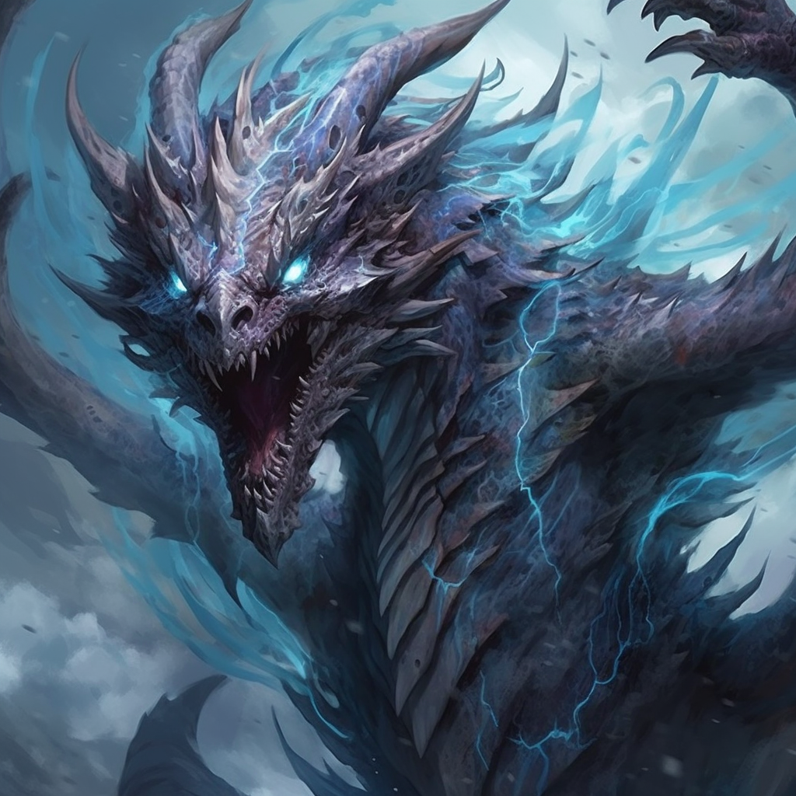

*A formidable dragonlich with ambitions to reshape the world in an undead image.*
#character #dragon 

**Name:** Zuldrakar  
**Race:** Dragonlich  
**Gender:** Male  
**Age:** Over 4,500 years
# Biography
Zuldrakar, once a fearsome dragon of immeasurable power, sought the secrets of immortality and in doing so, embraced the dark arts to transform himself into a dragonlich. With time, his dominion grew as he conquered lands, siphoning the life force of those he defeated to further bolster his strength. His voracious quest for arcane knowledge led him to uncover the catastrophic power of nuclear energy, which he bequeathed to the Dawn Siblings, seeing in them potential agents of widespread devastation.
# Character
Zuldrakar's lust for power and his understanding of the fragility of life drove him to embrace undeath. He values knowledge above all, often to the detriment of those around him. His formidable intellect, coupled with a detachment from the emotions of the living, is his strength. Yet, his arrogance and over-reliance on his lichdom can be his blind spots. He views mortals as mere pawns in his intricate game of cosmic chess, often underestimating the unpredictability of the living spirit.
# Appearance
**Physical Description:** A colossal skeletal dragon, patches of desiccated skin clutch to his formidable frame, while cold blue fires blaze within hollowed eye sockets, and ghostly mists float from his skeletal wings, reminiscent of the ethereal void.

**Voice:** Zuldrakar's voice carries the chilling echoes of the grave, intermingled with the confident tones of one who has seen countless epochs pass.

## Example Phrases
1. "Your petty spells are but a fleeting nuisance to my eternal might!"
2. "You dare stand before Zuldrakar, the eternal embodiment of death and decay?"
3. "The world has forgotten what true fear is. Allow me to remind it."
4. "Your souls shall be woven into the very tapestry of my dominion!"
5. "I've witnessed the fall of empires and the death of gods. You are but a brief shadow in my unending darkness."
# Stats
```statblock
name: Zuldrakar
creature: Ancient Black Dragonlich
languages: All
```
